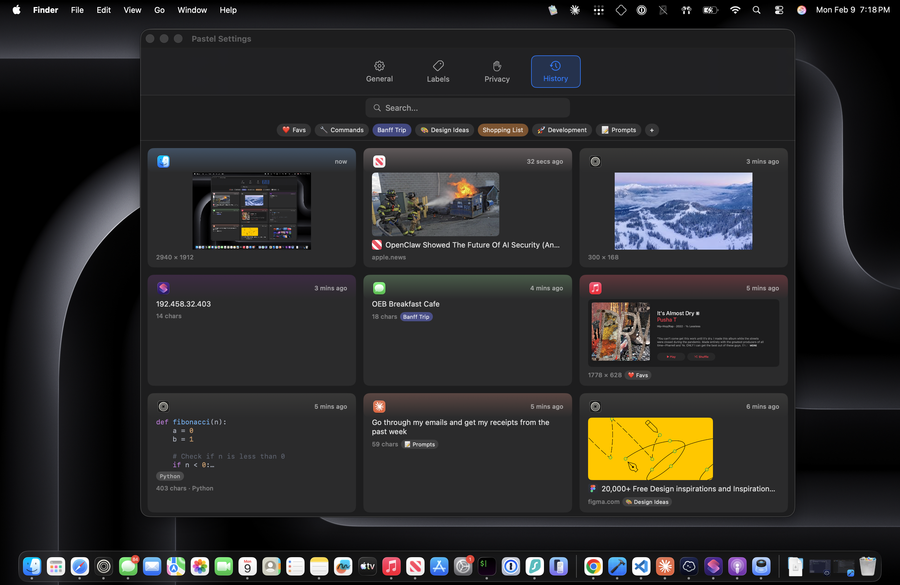

# Pastel

A native macOS clipboard manager. Copy once, paste forever.

Pastel lives in your menu bar and saves everything you copy — text, images, URLs, files, code, and colors — accessible instantly through a screen-edge sliding panel.

[Website](https://chiggi.me/pastel)

## Features

- **Universal capture** — text, images, URLs with rich previews, syntax-highlighted code, colors with swatches, and files
- **Screen-edge panel** — slides in from any edge with a global hotkey, Liquid Glass design on macOS Tahoe
- **Quick paste** — double-click, Enter, Cmd+1-9, or drag-n-drop to paste into any app without leaving your workflow
- **Search & labels** — full-text search across history, custom labels with 12 colors and emoji support
- **Keyboard-first** — arrow key navigation, hotkey-driven pasting, Shift+Enter for plain text paste
- **History browser** — grid view with multi-select, bulk actions, and import/export
- **Drag and drop** — drag items from the panel directly into other apps
- **iCloud sync** — optionally sync clipboard history across Macs via your own iCloud account
- **Privacy controls** — exclude specific apps from monitoring, respects password manager concealed types
- **Private by default** — all data stored locally on your Mac, no accounts, no analytics. Optional iCloud sync uses your personal iCloud — nothing touches our servers

## Install

1. Go to the [Releases](../../releases) page
2. Download the latest `.dmg` file
3. Open the DMG and drag Pastel to Applications
4. Launch Pastel — it will appear in your menu bar

**Requires macOS 15+**

On first launch, Pastel will ask for Accessibility permission to paste into other apps.

## License

GPL-3.0 — see [LICENSE](LICENSE) for details.
